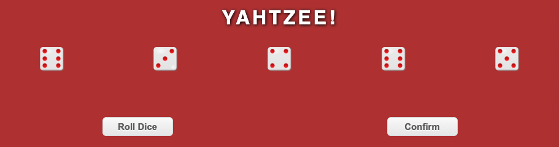

# Yahtzee

Just a simple, single player implementation of a classic.

If you haven't played before, just roll the dice. You get three rolls per turn. When you're ready to submit a score, just click in the right column.

 

## Screenshots

 

## Technologies
The game was built with:
* Javascript
* HTML
* CSS

 

## Getting Started
### [Play the Game](https://dtangie.github.io/yahtzee/)

Link: [https://dtangie.github.io/yahtzee/](https://dtangie.github.io/yahtzee/)

 

## Credits
Dice images from [OpenClipart-Vectors](https://pixabay.com/users/openclipart-vectors-30363/)